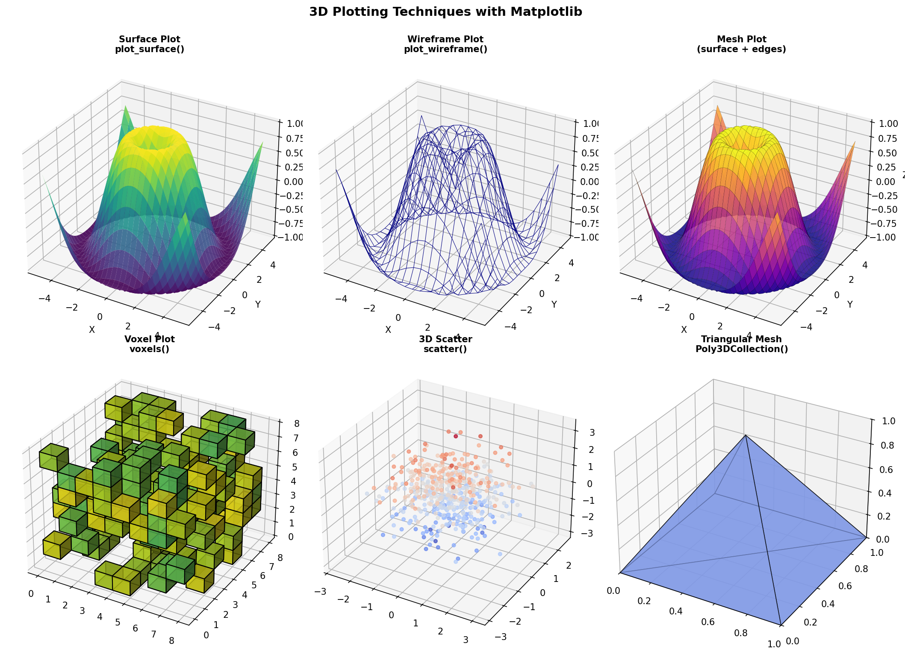

Title: 3D Plotting Techniques - Mesh, Surfaces, Volumes
Date: 2026-03-10
Author: Jack McKew
Category: Python
Tags: 3d, matplotlib, plotly, visualisation, mesh, surface

3D plotting is one of those things that looks impressive in a paper but can be genuinely hard to get right. I've spent the last year generating 3D plots for scientific visualization, and I've learned where each technique works and where it falls apart.

Let me walk through the practical toolkit: surfaces, meshes, wireframes, and voxels. I'll focus on the things that actually matter - when to use each, how to generate the data, and the gotchas that'll make you pull your hair out.

## Surface Plots

A surface is a 2D grid of points in 3D space. You have X and Y as a regular grid, and Z is a function of X and Y. Classic example: plot a mountain.

```python
import numpy as np
import matplotlib.pyplot as plt
from mpl_toolkits.mplot3d import Axes3D

# Create a grid
x = np.linspace(-5, 5, 100)
y = np.linspace(-5, 5, 100)
X, Y = np.meshgrid(x, y)

# Z is a function of X and Y
Z = np.sin(np.sqrt(X**2 + Y**2))

# Plot
fig = plt.figure(figsize=(10, 8))
ax = fig.add_subplot(111, projection='3d')

surf = ax.plot_surface(X, Y, Z, cmap='viridis', alpha=0.8)
fig.colorbar(surf, ax=ax, label='Height')

ax.set_xlabel('X')
ax.set_ylabel('Y')
ax.set_zlabel('Z')
ax.set_title('Surface Plot')

plt.show()
```

This works great for smooth, analytical functions. The `cmap` parameter colors the surface, and `alpha` controls transparency.

**The gotchas:**

- **Perspective distortion**: 3D plots lie. The same surface looks different depending on viewing angle. Always rotate and inspect from multiple angles.
- **Color mapping depth**: If you use color to represent a fourth dimension, it's hard to parse. Your eye confuses color with height.
- **Grid resolution**: Too few points and it looks blocky. Too many (1000x1000) and it's slow to render. Usually 100x100 is sweet spot.

For Plotly, the syntax is similar:

```python
import plotly.graph_objects as go

fig = go.Figure(data=[go.Surface(x=X, y=Y, z=Z, colorscale='Viridis')])
fig.update_layout(
    scene=dict(
        xaxis_title='X',
        yaxis_title='Y',
        zaxis_title='Z'
    )
)
fig.show()
```

Plotly surfaces are interactive - you can rotate and zoom. Matplotlib is static once you display it.

## Wireframe Plots

A wireframe shows just the edges of the surface, not the filled triangles. Useful for seeing the structure without being distracted by shading.

```python
# Matplotlib wireframe
fig = plt.figure(figsize=(10, 8))
ax = fig.add_subplot(111, projection='3d')

ax.plot_wireframe(X, Y, Z, color='black', linewidth=0.5)

ax.set_xlabel('X')
ax.set_ylabel('Y')
ax.set_zlabel('Z')
plt.show()
```

Wireframes are fast and clean. They're good for exploring structure. The downside: they're ugly in presentations. Scientists love them, stakeholders don't.

## Mesh Plots

A mesh is like a wireframe but colored. It's the middle ground.

```python
# Matplotlib mesh
fig = plt.figure(figsize=(10, 8))
ax = fig.add_subplot(111, projection='3d')

# Use cstride and rstride to control wireframe density
ax.plot_surface(X, Y, Z, cmap='viridis', alpha=0.8,
                edgecolor='black', linewidth=0.2)

plt.show()
```

The `edgecolor` and `linewidth` parameters show the mesh edges. This makes the surface readable and gives depth cues. It's my go-to for scientific papers.

## Voxel Plots (Volumetric Data)

Voxels are 3D pixels. Use them when you have data on a regular 3D grid - CT scans, fluid simulations, climate models.

```python
import numpy as np
from mpl_toolkits.mplot3d import Axes3D
import matplotlib.pyplot as plt

# Create a 3D grid of values
shape = (10, 10, 10)
voxels = np.random.randint(0, 2, shape)

# Plot
fig = plt.figure(figsize=(10, 8))
ax = fig.add_subplot(111, projection='3d')

ax.voxels(voxels, edgecolor='black', alpha=0.7)

ax.set_xlabel('X')
ax.set_ylabel('Y')
ax.set_zlabel('Z')
plt.show()
```

This draws cubes for every True/1 value in the array. It's great for binary data (is this voxel occupied or not?) but less useful for continuous values.

For continuous volumetric data, you're better off with a library like VTK or Mayavi, which handle volume rendering (ray-tracing through the data to show density/transparency).

```python
# If you want colored voxels
import matplotlib.cm as cm

fig = plt.figure(figsize=(10, 8))
ax = fig.add_subplot(111, projection='3d')

# Generate data with continuous values
voxel_data = np.random.rand(10, 10, 10)

# Only plot voxels above a threshold, colored by value
voxels = voxel_data > 0.5

# Map scalar values to RGBA colors via a colormap
# cm.viridis returns (N, N, N, 4) array - shape matches voxels automatically
colors = cm.viridis(voxel_data)
colors[..., 3] = np.where(voxels, 0.8, 0)  # alpha: visible only where True

ax.voxels(voxels, facecolors=colors, edgecolor='black', linewidth=0.3)

plt.show()
```

This is tedious and doesn't scale well beyond ~20x20x20. For real volume rendering, use a specialist tool.

## Scatter in 3D

Sometimes you just have a cloud of points.

```python
import numpy as np

# Generate random 3D points
n_points = 1000
x = np.random.normal(0, 1, n_points)
y = np.random.normal(0, 1, n_points)
z = np.random.normal(0, 1, n_points)
colors = np.random.rand(n_points)

fig = plt.figure(figsize=(10, 8))
ax = fig.add_subplot(111, projection='3d')

scatter = ax.scatter(x, y, z, c=colors, cmap='viridis', s=20, alpha=0.6)
fig.colorbar(scatter, ax=ax, label='Color value')

ax.set_xlabel('X')
ax.set_ylabel('Y')
ax.set_zlabel('Z')
plt.show()
```

The `c` parameter colors points by a fourth dimension. The `s` parameter controls size. Matplotlib scatter is fine for exploration, but for interactive exploration (zoom, pan, rotate), Plotly is better.

## Triangular Mesh

If you have unstructured data - arbitrary 3D points and triangles connecting them - you need a different approach. This is common for 3D models, point clouds, and reconstructed surfaces.

```python
from mpl_toolkits.mplot3d.art3d import Poly3DCollection
import numpy as np

# Define vertices
vertices = np.array([
    [0, 0, 0],
    [1, 0, 0],
    [1, 1, 0],
    [0, 1, 0],
    [0.5, 0.5, 1]
])

# Define triangles (indices into vertices)
faces = np.array([
    [0, 1, 4],
    [1, 2, 4],
    [2, 3, 4],
    [3, 0, 4],
    [0, 1, 2],  # Base
    [0, 2, 3]
])

fig = plt.figure(figsize=(10, 8))
ax = fig.add_subplot(111, projection='3d')

# Create polygon collection
mesh = Poly3DCollection(vertices[faces], alpha=0.7, edgecolor='black')
mesh.set_facecolor([0.5, 0.5, 0.9])
ax.add_collection3d(mesh)

# Set limits
ax.set_xlim([0, 1])
ax.set_ylim([0, 1])
ax.set_zlim([0, 1])

ax.set_xlabel('X')
ax.set_ylabel('Y')
ax.set_zlabel('Z')
plt.show()
```

This builds a 3D pyramid. The key is `Poly3DCollection` - it takes vertices and face indices and renders them.

## Axis Scaling and Perspective

One huge gotcha: 3D plots don't scale axes the same. By default, matplotlib makes Z smaller than X and Y, which distorts the view.

```python
# Bad - distorted
ax.plot_surface(X, Y, Z)

# Better - equal aspect ratio
ax.set_box_aspect([1, 1, 1])
ax.set_xlim([x.min(), x.max()])
ax.set_ylim([y.min(), y.max()])
ax.set_zlim([Z.min(), Z.max()])
```

Same with Plotly:

```python
fig.update_layout(
    scene=dict(
        aspectmode='data',  # Scale axes by actual data ranges
        # aspectratio can also be set explicitly:
        # aspectratio=dict(x=1, y=1, z=0.5)
    )
)
```

## The Practical Toolkit

Here's what I use:

- **Smooth analytical surfaces**: `matplotlib.plot_surface()` for papers, `plotly.Surface` for interactive.
- **Wireframes for exploration**: `matplotlib.plot_wireframe()` - fast and informative.
- **Meshes for publication**: Colored surface with black edges.
- **Point clouds**: Plotly scatter for interactive, matplotlib for static.
- **Binary voxels**: `matplotlib.voxels()` for small grids only.
- **Volumetric data**: Mayavi or VTK - matplotlib can't handle it well.

The honest take: 3D plotting is hard because humans are bad at perceiving depth in 2D images. Add color, add rotation, add annotations - they all help but nothing replaces a physical model you can hold.

For most purposes, a 2D projection or slice (looking at a cross-section) is more informative than a fancy 3D plot. Don't use 3D because it looks cool. Use it because it's the clearest way to show your data.


