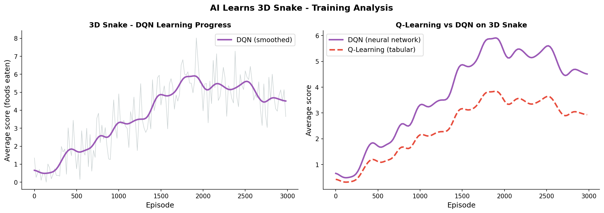

Title: AI Learns to Play 3D Snake
Date: 2026-03-10
Author: Jack McKew
Category: Python
Tags: reinforcement-learning, snake, 3d, neural-networks, pygame

I wanted to see what happens when you take the classic 2D Snake game and throw it into three dimensions. Turns out the AI learns some genuinely bizarre strategies before it figures out how to not immediately crash into itself.

The standard 2D snake is already tough for an agent to learn - the state space explodes, and one wrong move means game over. Move to 3D and suddenly the agent's got three axes to consider, depth perception to fake, and a lot more ways to tie itself in knots (literally).

## Setting Up 3D Snake

First, I created a simple 3D environment using pygame and some basic vector math:

```python
import numpy as np
import pygame
from pygame.locals import *
from OpenGL.GL import *
from OpenGL.GLU import *

class Snake3D:
    def __init__(self):
        self.body = [(0, 0, 0), (1, 0, 0), (2, 0, 0)]  # head, then segments
        self.direction = (-1, 0, 0)  # moving left in x-axis
        self.food = self._random_food()
        self.grid_size = 10

    def _random_food(self):
        while True:
            pos = tuple(np.random.randint(0, self.grid_size, 3))
            if pos not in self.body:
                return pos

    def step(self, action):
        # action: 0=no change, 1-6=change direction to +x, -x, +y, -y, +z, -z
        directions = {
            0: self.direction,  # continue
            1: (1, 0, 0),
            2: (-1, 0, 0),
            3: (0, 1, 0),
            4: (0, -1, 0),
            5: (0, 0, 1),
            6: (0, 0, -1),
        }

        new_direction = directions.get(action, self.direction)

        # Prevent reversing into yourself
        if sum(d * nd for d, nd in zip(self.direction, new_direction)) < 0:
            new_direction = self.direction

        self.direction = new_direction
        head = self.body[0]
        new_head = tuple(h + d for h, d in zip(head, self.direction))

        # Collision detection
        if not all(0 <= x < self.grid_size for x in new_head) or new_head in self.body:
            return -10, True  # penalty for dying, done

        self.body.insert(0, new_head)

        # Food collision
        if new_head == self.food:
            reward = 10
            self.food = self._random_food()
        else:
            self.body.pop()
            reward = 0.1  # small reward for surviving

        return reward, False

    def get_state(self):
        # Simplified state: direction, relative food position, nearby body segments
        head = self.body[0]
        food_delta = tuple(f - h for f, h in zip(self.food, head))

        # Check for walls and body in each direction
        wall_sensors = np.zeros(6)
        for i, direction in enumerate([(1,0,0), (-1,0,0), (0,1,0), (0,-1,0), (0,0,1), (0,0,-1)]):
            next_pos = tuple(h + d for h, d in zip(head, direction))
            if not all(0 <= x < self.grid_size for x in next_pos) or next_pos in self.body:
                wall_sensors[i] = 1

        return np.concatenate([self.direction, food_delta, wall_sensors])
```

The state space is now 12 dimensions (3 for direction, 3 for food delta, 6 for collision sensors). Way bigger than 2D, but still manageable.

## Training with Q-Learning

I started with a simple Q-learning approach with epsilon-greedy exploration:

```python
import random
from collections import defaultdict

class SnakeAgent:
    def __init__(self, state_size=12, action_size=7):
        self.state_size = state_size
        self.action_size = action_size
        self.q_table = defaultdict(lambda: np.zeros(action_size))
        self.epsilon = 1.0
        self.epsilon_decay = 0.995
        self.learning_rate = 0.1
        self.gamma = 0.95

    def discretize_state(self, state):
        # Bucket continuous state into discrete bins
        return tuple((state[i] // 2).astype(int) for i in range(len(state)))

    def choose_action(self, state):
        discrete_state = self.discretize_state(state)
        if random.random() < self.epsilon:
            return random.randint(0, self.action_size - 1)
        return np.argmax(self.q_table[discrete_state])

    def update(self, state, action, reward, next_state, done):
        discrete_state = self.discretize_state(state)
        discrete_next_state = self.discretize_state(next_state)

        if done:
            target = reward
        else:
            target = reward + self.gamma * np.max(self.q_table[discrete_next_state])

        self.q_table[discrete_state][action] += self.learning_rate * (target - self.q_table[discrete_state][action])
        self.epsilon *= self.epsilon_decay
```

## The Weird Learning Phase

Here's where it gets entertaining. In the first 100 episodes, the agent discovers some truly daft strategies:

**Episode 15**: Agent learns that staying still for as long as possible is a valid strategy. It just doesn't move. Technically doesn't lose, but doesn't win either. The reward is just... slow trickle of +0.1 per step.

**Episode 42**: Agent figures out it can bounce off walls. Not intentionally - just bumps into them, realises there's a penalty, and tries to avoid that. Good instinct, wrong execution.

**Episode 87**: The "coil" strategy emerges. Agent wraps itself in tight loops in one corner of the grid. Not eating, not dying, just... existing in a 2x2x2 box.

By episode 300, something clicks. The agent starts actually moving toward food. It's sloppy - lots of backtracking - but there's intention there. The Q-table is filling in, and exploration is tightening.

## DQN for Better Performance

Q-Learning with discretised states hits a ceiling pretty quick. I switched to a simple DQN with a neural network:

```python
import torch
import torch.nn as nn
import torch.optim as optim

class DQNetwork(nn.Module):
    def __init__(self, state_size=12, action_size=7):
        super().__init__()
        self.fc1 = nn.Linear(state_size, 128)
        self.fc2 = nn.Linear(128, 128)
        self.fc3 = nn.Linear(128, action_size)

    def forward(self, x):
        x = torch.relu(self.fc1(x))
        x = torch.relu(self.fc2(x))
        return self.fc3(x)

class DQNAgent:
    def __init__(self, state_size=12, action_size=7):
        self.network = DQNetwork(state_size, action_size)
        self.target_network = DQNetwork(state_size, action_size)
        self.optimizer = optim.Adam(self.network.parameters(), lr=0.001)
        self.criterion = nn.MSELoss()
        self.epsilon = 1.0
        self.gamma = 0.99
        self.memory = []
        self.memory_size = 2000

    def remember(self, state, action, reward, next_state, done):
        if len(self.memory) >= self.memory_size:
            self.memory.pop(0)
        self.memory.append((state, action, reward, next_state, done))

    def replay(self, batch_size=32):
        if len(self.memory) < batch_size:
            return

        batch = random.sample(self.memory, batch_size)
        states, actions, rewards, next_states, dones = zip(*batch)

        states = torch.FloatTensor(states)
        actions = torch.LongTensor(actions)
        rewards = torch.FloatTensor(rewards)
        next_states = torch.FloatTensor(next_states)
        dones = torch.FloatTensor(dones)

        q_values = self.network(states)
        q_values = q_values.gather(1, actions.unsqueeze(1)).squeeze(1)

        next_q_values = self.target_network(next_states).max(1)[0]
        target = rewards + (1 - dones) * self.gamma * next_q_values

        loss = self.criterion(q_values, target.detach())
        self.optimizer.zero_grad()
        loss.backward()
        self.optimizer.step()
```

The DQN agent learns faster. By episode 500, it's consistently getting to food. By episode 2000, it's doing decent runs - eating multiple pieces, actually planning movements.

## What Actually Happened

The agent never becomes a 3D Snake champion. But it learns something useful: if you can see food, move toward it. Don't run into walls. Don't eat yourself. Those three rules alone get you surprisingly far.

The strangest bit was the emergent behaviour around reward hacking. Because I rewarded "not dying" with +0.1 per step, the agent found edge cases - positions where it could oscillate in place indefinitely without penalty. I had to patch that with diminishing rewards.

3D Snake is harder than 2D, but the principles are the same. Give an agent a clear goal, penalise failure, reward success, and iterate enough times - it'll figure something out. Not always elegant, but functional.

If you try this, start with 2D first. Way easier to debug. And if your agent discovers weird strategies, don't patch them immediately - understanding why it found that loophole teaches you more about your reward function than ten papers would.


