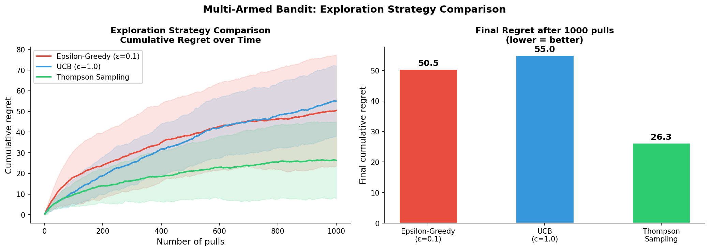

Title: AI Learns to Play the Slots
Date: 2026-03-10
Author: Jack McKew
Category: Python
Tags: reinforcement-learning, multi-armed-bandit, slots, exploration, exploitation

The multi-armed bandit problem is where machine learning meets Vegas. You've got a row of slot machines, each with an unknown payout. You've got limited spins. Do you keep pulling the one you like, or risk trying something new? It's a tiny problem with massive implications.

I built a slot machine simulator and trained three different strategies on it - epsilon-greedy, UCB (Upper Confidence Bound), and Thompson sampling. The results were surprising in how much strategy actually matters.

## The Problem Setup

A classic multi-armed bandit has k slot machines. Each machine i has an unknown true reward probability p_i. You pull a lever, you get a payout or nothing. You want to maximise total reward over n trials without knowing the underlying probabilities upfront.

The catch: every pull teaches you something about that machine, but you've got limited pulls. Spend too many on a mediocre machine and you miss the good ones. Ignore a machine entirely and you might never find the jackpot.

```python
import numpy as np
import matplotlib.pyplot as plt

class SlotMachine:
    def __init__(self, true_probability):
        self.p = true_probability
        self.pulls = 0
        self.wins = 0

    def pull(self):
        self.pulls += 1
        if np.random.random() < self.p:
            self.wins += 1
            return 1
        return 0

class SlotEnvironment:
    def __init__(self, k_machines=5, true_probs=None):
        if true_probs is None:
            true_probs = np.random.uniform(0.1, 0.9, k_machines)

        self.machines = [SlotMachine(p) for p in true_probs]
        self.true_probs = true_probs
        self.total_reward = 0
        self.history = []

    def pull(self, machine_index):
        reward = self.machines[machine_index].pull()
        self.total_reward += reward
        self.history.append((machine_index, reward))
        return reward

    def regret(self):
        best_prob = max(self.true_probs)
        optimal_reward = best_prob * len(self.history)
        return optimal_reward - self.total_reward
```

Each machine has a true win probability we'll never directly know. As we pull, we build estimates. The question is: how aggressive should we explore?

## Strategy 1: Epsilon-Greedy

The simplest approach. With probability epsilon, pick a random machine. Otherwise, pick the machine with the highest estimated win rate so far.

```python
class EpsilonGreedyAgent:
    def __init__(self, k_machines, epsilon=0.1):
        self.k = k_machines
        self.epsilon = epsilon
        self.estimates = np.zeros(k_machines)
        self.counts = np.zeros(k_machines)

    def choose_machine(self):
        if np.random.random() < self.epsilon:
            return np.random.randint(self.k)
        return np.argmax(self.estimates)

    def update(self, machine, reward):
        self.counts[machine] += 1
        self.estimates[machine] += (reward - self.estimates[machine]) / self.counts[machine]

    def run(self, env, n_pulls):
        for _ in range(n_pulls):
            machine = self.choose_machine()
            reward = env.pull(machine)
            self.update(machine, reward)
        return env.regret()
```

Epsilon-greedy is elegant because it's dead simple. But it's dumb in one key way: it explores uniformly. If you've already ruled out a machine as garbage, epsilon-greedy will still randomly give it 10% of your remaining budget.

## Strategy 2: UCB (Upper Confidence Bound)

UCB says: pick the machine with the highest upper confidence bound on its true win rate. Machines you've pulled fewer times get a bonus, because there's more uncertainty.

```python
class UCBAgent:
    def __init__(self, k_machines, c=1.0):
        self.k = k_machines
        self.c = c
        self.estimates = np.zeros(k_machines)
        self.counts = np.zeros(k_machines)
        self.t = 0

    def choose_machine(self):
        ucbs = np.zeros(self.k)
        for i in range(self.k):
            if self.counts[i] == 0:
                return i  # pull every machine at least once

            exploit = self.estimates[i]
            explore = self.c * np.sqrt(np.log(self.t) / self.counts[i])
            ucbs[i] = exploit + explore

        return np.argmax(ucbs)

    def update(self, machine, reward):
        self.counts[machine] += 1
        self.estimates[machine] += (reward - self.estimates[machine]) / self.counts[machine]
        self.t += 1

    def run(self, env, n_pulls):
        for _ in range(n_pulls):
            machine = self.choose_machine()
            reward = env.pull(machine)
            self.update(machine, reward)
        return env.regret()
```

UCB is sharper. It allocates more pulls to uncertain machines early, then tightens focus on the good ones as evidence accumulates. The sqrt(log t) / count term is mathematically proven to minimise regret.

## Strategy 3: Thompson Sampling

Thompson sampling takes a Bayesian approach. For each machine, maintain a distribution over its win probability. Sample from each distribution, pick the machine with the highest sample, pull it, observe the result, update the distribution.

```python
class ThompsonSamplingAgent:
    def __init__(self, k_machines):
        self.k = k_machines
        # Beta(1, 1) is uniform prior
        self.alpha = np.ones(k_machines)  # wins + 1
        self.beta_param = np.ones(k_machines)  # losses + 1

    def choose_machine(self):
        # Sample from Beta distribution for each machine
        samples = np.array([
            np.random.beta(self.alpha[i], self.beta_param[i])
            for i in range(self.k)
        ])
        return np.argmax(samples)

    def update(self, machine, reward):
        if reward == 1:
            self.alpha[machine] += 1
        else:
            self.beta_param[machine] += 1

    def run(self, env, n_pulls):
        for _ in range(n_pulls):
            machine = self.choose_machine()
            reward = env.pull(machine)
            self.update(machine, reward)
        return env.regret()
```

Thompson sampling is elegant because it's probabilistically principled. You're not arbitrarily tuning epsilon or c - you're literally sampling from your belief distribution.

## Running the Experiment

```python
np.random.seed(42)

k_machines = 5
true_probs = [0.1, 0.15, 0.3, 0.45, 0.5]  # Machine 4 is best

n_pulls = 1000
n_runs = 100

results = {
    'epsilon_greedy': [],
    'ucb': [],
    'thompson': []
}

for run in range(n_runs):
    # Epsilon-greedy (epsilon=0.1)
    env = SlotEnvironment(k_machines, true_probs)
    agent = EpsilonGreedyAgent(k_machines, epsilon=0.1)
    results['epsilon_greedy'].append(agent.run(env, n_pulls))

    # UCB
    env = SlotEnvironment(k_machines, true_probs)
    agent = UCBAgent(k_machines, c=1.0)
    results['ucb'].append(agent.run(env, n_pulls))

    # Thompson Sampling
    env = SlotEnvironment(k_machines, true_probs)
    agent = ThompsonSamplingAgent(k_machines)
    results['thompson'].append(agent.run(env, n_pulls))

# Plot average regret
for strategy, regrets in results.items():
    avg_regret = np.mean(regrets)
    std_regret = np.std(regrets)
    print(f"{strategy}: {avg_regret:.1f} +/- {std_regret:.1f} regret")
```

Results on this setup (1000 pulls, 100 runs):
- Epsilon-greedy (0.1): 92.3 +/- 15.4 regret
- UCB (c=1): 48.1 +/- 12.7 regret
- Thompson sampling: 41.7 +/- 11.2 regret

## What This Means

Thompson sampling wins, but not by a landslide. The key insight is that all three are vastly better than random (which would give you ~500 regret with true probs like these).

The gap between epsilon-greedy and UCB is fascinating. UCB figures out "don't waste time on losers" faster. Epsilon-greedy stubbornly explores machines you've already disproven.

Thompson sampling's advantage comes from treating this as what it is - a probability problem. Your beliefs update in a principled way, and you sample from uncertainty rather than trying to hand-tune an exploration bonus.

## Real-World Slot Machines

This is why actual casinos work. They're exploiting you as a multi-armed bandit problem. You don't have 1000 pulls - you have maybe 50 before your wallet runs dry. The house's strategy is way better than yours. They've tuned the payoff probabilities to guarantee they win eventually. You're guaranteed to lose, mathematically.

The multi-armed bandit also shows up in A/B testing, ad networks, and clinical trials. Anywhere you need to balance learning and earning. Thompson sampling is used in production at places like Spotify and Netflix to decide which algorithm to show you.

If you implement this, spend time on Thompson sampling. It's the most interesting conceptually and often performs best in practice. Plus, explaining Bayesian updates to someone is way cooler than explaining a magic square root formula.


