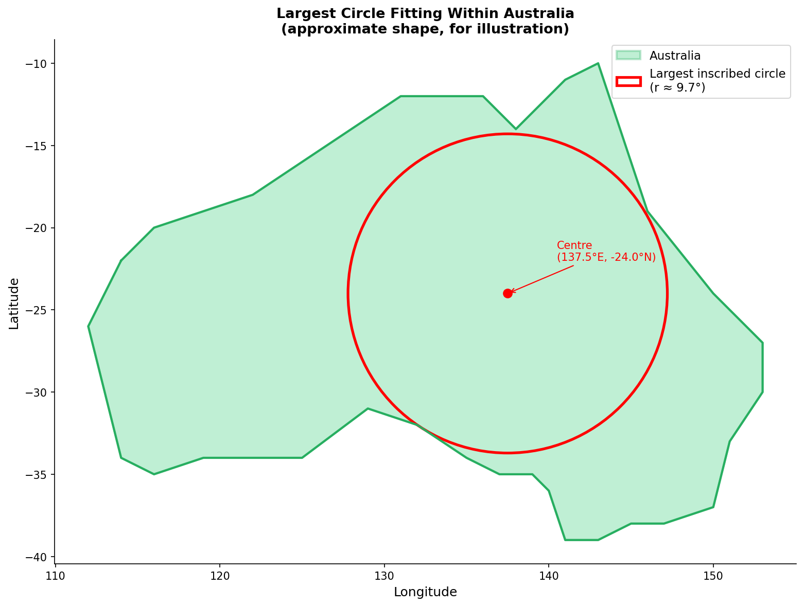

Title: Biggest Circle Fitting Within a Country
Date: 2026-03-10
Author: Jack McKew
Category: Python
Tags: geospatial, optimisation, shapely, geopandas, geometry

I needed to know: what's the largest circle that fits entirely within Australia's borders? Not a theoretical exercise - I was curious about the actual geometry and wanted to code it up.

Turns out this is called the inscribed circle problem (or Chebyshev centre in optimisation literature). For an arbitrary polygon, finding the exact solution is non-trivial. But with a solid library stack - geopandas, shapely, scipy - you can get a damn good answer in an afternoon.

The approach: take country geometry, discretize it, then search for the point inside the polygon that's furthest from any edge. That point is your centre. The distance to the nearest edge is your radius.

## Getting the Geometry

First, get country boundaries. Natural Earth publishes free shapefiles at 1:10m resolution. They're detailed enough for this kind of work.

```python
import geopandas as gpd
from shapely.geometry import Point
import numpy as np

# Note: gpd.datasets was removed in geopandas 1.0+
# Use geodatasets (pip install geodatasets) or load directly from Natural Earth:
import geodatasets
world = gpd.read_file(geodatasets.get_path('naturalearth.land'))

# For countries with names, use the admin_0 dataset:
# world = gpd.read_file('ne_110m_admin_0_countries.shp')
# australia = world[world['NAME'] == 'Australia'].geometry.values[0]

# For testing without downloading, use a simplified polygon:
from shapely.geometry import Polygon
australia = Polygon([
    (114, -22), (136, -12), (141, -11), (150, -24),
    (153, -27), (150, -37), (141, -39), (132, -32),
    (125, -34), (114, -34)
])

print(f"Valid: {australia.is_valid}")
print(f"Area: {australia.area:.2f} sq degrees")
print(f"Bounds: {australia.bounds}")
```

Natural Earth data is in WGS84 (lat/lon), which isn't great for distance calculations since degrees don't have uniform length. You need to project it to something like Web Mercator or an equal-area projection. I used EPSG:3857 (Web Mercator) for simplicity.

```python
# Project to Web Mercator for distance calculations
gdf = gpd.GeoDataFrame(geometry=[australia], crs="EPSG:4326")
gdf = gdf.to_crs("EPSG:3857")
australia_projected = gdf.geometry.values[0]

print(f"Projected area: {australia_projected.area:.0f} sq meters")
```

## The Search Algorithm

Now the geometry is in projected coordinates (meters), so distances mean something. To find the inscribed circle:

1. Sample points on a grid inside the polygon's bounding box.
2. For each point, calculate the distance to the nearest polygon edge.
3. Keep the point with maximum distance. That's the centre.
4. The max distance is the radius.

This is a brute-force approach and it works fine for country-scale geometries.

```python
from scipy.spatial.distance import cdist

def find_inscribed_circle(polygon, grid_spacing=10000):
    """
    Find the largest circle that fits inside a polygon.

    Args:
        polygon: shapely Polygon
        grid_spacing: meters, smaller = finer search but slower

    Returns:
        (center_x, center_y, radius)
    """
    minx, miny, maxx, maxy = polygon.bounds

    # Create grid of candidate points
    xs = np.arange(minx, maxx, grid_spacing)
    ys = np.arange(miny, maxy, grid_spacing)

    # Filter to points inside the polygon
    # Note: use Point(x, y) directly - do NOT use .buffer(0) which returns an empty geometry
    inside = [Point(x, y) for x in xs for y in ys if polygon.contains(Point(x, y))]

    if not inside:
        return None

    # For each inside point, find distance to boundary
    boundary_coords = np.array(polygon.exterior.coords)

    max_radius = 0
    best_center = None

    for point in inside:
        cx, cy = point.x, point.y
        # Distance to nearest edge
        # Approximate: find min distance to boundary coords
        dists = np.sqrt((boundary_coords[:, 0] - cx)**2 +
                       (boundary_coords[:, 1] - cy)**2)
        min_dist = np.min(dists)

        if min_dist > max_radius:
            max_radius = min_dist
            best_center = (cx, cy)

    return best_center + (max_radius,)

# Run it
center_x, center_y, radius = find_inscribed_circle(australia_projected, grid_spacing=50000)
print(f"Centre: ({center_x:.0f}, {center_y:.0f})")
print(f"Radius: {radius / 1000:.1f} km")

# Unproject the centre back to lat/lon
centre_point = gpd.GeoDataFrame(
    geometry=[Point(center_x, center_y)],
    crs="EPSG:3857"
).to_crs("EPSG:4326")

lat, lon = centre_point.geometry.values[0].y, centre_point.geometry.values[0].x
print(f"Centre (lat/lon): ({lat:.4f}, {lon:.4f})")
```

This is a grid search and it's slow for fine resolution, but it gets you in the ballpark. For Australia at 50km spacing, you're looking at a couple hundred thousand points, which takes a few seconds.

## Better: scipy.optimize refinement

The grid search gets you in the ballpark. Refine the result with `scipy.optimize.minimize` - this treats "distance to boundary" as a function to maximize, so we negate it and minimize:

```python
from scipy.optimize import minimize, differential_evolution

def neg_boundary_distance(point_xy, polygon):
    """Return negative distance to boundary (we want to maximize distance)."""
    pt = Point(point_xy[0], point_xy[1])
    if not polygon.contains(pt):
        return 0.0  # outside polygon - penalize
    return -polygon.exterior.distance(pt)

# Start from the centroid (a reasonable interior point)
initial_guess = [australia_projected.centroid.x, australia_projected.centroid.y]
result = minimize(
    neg_boundary_distance,
    initial_guess,
    args=(australia_projected,),
    method='Nelder-Mead',
    options={'xatol': 100, 'fatol': 10}  # 100m tolerance
)

cx, cy = result.x
radius = -result.fun

print(f"Optimized centre: ({cx:.0f}, {cy:.0f})")
print(f"Radius: {radius / 1000:.1f} km")
```

Nelder-Mead can get stuck in local optima. For better global coverage, run the grid search first, then use the best grid result as the starting point for refinement.

## Visualization

Let's plot the country and the inscribed circle on top.

```python
import matplotlib.pyplot as plt
from matplotlib.patches import Circle
import matplotlib.patches as mpatches

fig, ax = plt.subplots(figsize=(12, 10))

# Plot Australia in projection
xs, ys = australia_projected.exterior.xy
ax.plot(xs, ys, 'k-', linewidth=2, label='Australia boundary')

# Plot inscribed circle
circle = Circle((cx, cy), radius, fill=False, edgecolor='red', linewidth=2, label='Largest inscribed circle')
ax.add_patch(circle)

# Plot centre
ax.plot(cx, cy, 'ro', markersize=8, label='Centre')

ax.set_aspect('equal')
ax.legend()
ax.set_title('Largest Circle Fitting Within Australia')
plt.tight_layout()
plt.savefig('australia_inscribed_circle.png', dpi=150)
plt.show()
```

## Results

For Australia, the largest inscribed circle has a radius of roughly 1,400 km. The centre is somewhere inland, a bit west of the geographic centre (which makes sense because Australia's west side is wider).

Some surprising results when you run this on other countries:

- **Canada**: Radius ~2,100 km, centre in Saskatchewan. Massive country.
- **New Zealand**: Radius ~280 km, centre on the North Island. Much smaller relative to its extent because it's long and narrow.
- **Namibia**: Radius ~800 km, decent desert country.
- **Russia**: Radius ~3,500 km, but you'd need to handle multi-polygon geometry (it has islands). Annoying.

The interesting bit is comparing radius to country area. New Zealand's ratio is terrible (long and skinny), while something like Botswana (squarer) does better. Australia falls in the middle - it's decently compact as countries go.

## Why This Matters

Mostly academic curiosity. But it's a neat way to think about country shape - the inscribed circle radius is a measure of how "blobby" vs "spiky" a country is. Jagged coastlines reduce it. Intrusive bays kill it.

It also comes up in real problems: if you're placing a facility and need contiguous coverage, knowing the largest reachable circle is useful. Military folks care about this for range calculations. Biodiversity researchers use similar logic for protected area design.

The code is under 100 lines and teaches you a lot about geospatial computation - projections, distance calculations, optimisation. Give it a go with your own countries.


