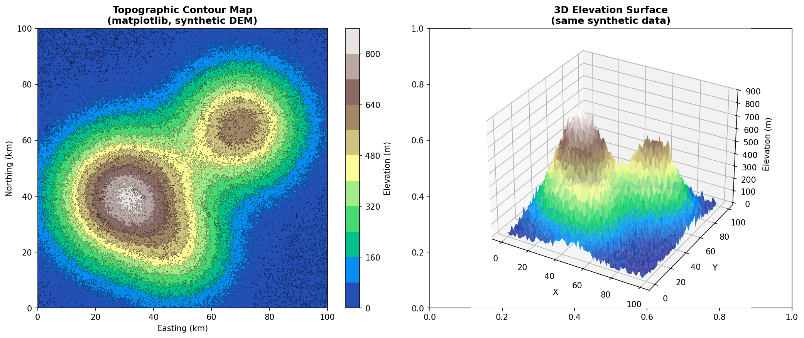

Title: Interactive Contour to Topographic Map
Date: 2026-03-10
Author: Jack McKew
Category: Python
Tags: topography, contour, matplotlib, plotly, geospatial, visualisation

I spent an afternoon turning a flat DEM (Digital Elevation Model) into something that actually looks like a map. You know those squiggly lines on topographic maps? Turns out they're harder to get right than you'd think, and making them interactive is even trickier.

## Getting elevation data

The fun part starts with data. USGS and ESA both serve DEM files online. I grabbed a sample from the USGS 3DEP database - it's a GeoTIFF file with elevation values at regular intervals. Here's how to load it:

```python
import rasterio
import numpy as np
from rasterio.plot import show

# Load the DEM
dem_path = 'dem_sample.tif'
with rasterio.open(dem_path) as src:
    elevation = src.read(1)
    bounds = src.bounds
    transform = src.transform

print(f"Shape: {elevation.shape}")  # (2048, 2048) typically
print(f"Min elevation: {elevation.min()}, Max: {elevation.max()}")
```

DEMs come in flavours. 30m resolution is standard in the US (SRTM), but you can get 1m LiDAR if you dig. The bigger the array, the more detail, and the slower the computation. I started with 30m because it's clean and doesn't kill your machine.

If you don't have a real DEM handy, generate synthetic terrain to test with:

```python
import numpy as np
from scipy.ndimage import gaussian_filter

x = np.linspace(0, 100, 500)
y = np.linspace(0, 100, 500)
X, Y = np.meshgrid(x, y)

elevation = (
    800 * np.exp(-((X - 30)**2 + (Y - 40)**2) / 500) +
    600 * np.exp(-((X - 70)**2 + (Y - 65)**2) / 400) +
    300 * np.exp(-((X - 50)**2 + (Y - 20)**2) / 300) +
    50 * np.random.default_rng(42).standard_normal(X.shape)
)
elevation = np.clip(elevation, 0, None)
```

## Generating contour lines

Here's where the maths matters. A contour line connects all points at the same elevation. You can't just interpolate linearly between grid points - you need proper interpolation, or your contours look chunky and wrong.

```python
import matplotlib.pyplot as plt
from scipy.interpolate import RectBivariateSpline

# Create coordinate grids
rows, cols = elevation.shape
x = np.arange(cols)
y = np.arange(rows)
xx, yy = np.meshgrid(x, y)

# Generate contours with matplotlib
fig, ax = plt.subplots(figsize=(12, 10))
levels = np.arange(elevation.min(), elevation.max(), 50)  # 50m contour interval
cs = ax.contour(xx, yy, elevation, levels=levels, linewidths=0.5)
ax.clabel(cs, inline=True, fontsize=8)

ax.set_aspect('equal')
plt.savefig('contours.png', dpi=150, bbox_inches='tight')
plt.show()
```

This works, but matplotlib contours are raster-based. They're fine for static images, but they don't scale to interactive maps. You get aliasing, and zooming looks jagged.

## Interactive version with Plotly

For something you can actually click on and explore, Plotly is the move:

```python
import plotly.graph_objects as go
import plotly.express as px

fig = go.Figure()

# Filled contour plot (think of it like a heatmap)
fig.add_trace(go.Contourf(
    x=x, y=y, z=elevation,
    colorscale='Viridis',
    showscale=True,
    colorbar=dict(title="Elevation (m)"),
    contours=dict(
        start=elevation.min(),
        end=elevation.max(),
        size=100,  # 100m intervals
    )
))

# Add contour lines on top
fig.add_trace(go.Contour(
    x=x, y=y, z=elevation,
    showscale=False,
    line=dict(color='white', width=0.5),
    contours=dict(
        start=elevation.min(),
        end=elevation.max(),
        size=50,
    ),
    hovertemplate='<b>Elevation: %{z:.1f}m</b><extra></extra>'
))

fig.update_layout(
    title='Interactive Topographic Map',
    xaxis_title='Easting',
    yaxis_title='Northing',
    width=1000, height=900,
    hovermode='closest'
)

fig.show()
```

Now you've got zoom, pan, and hover tooltips. The contours stay crisp as you zoom because Plotly renders them client-side.

## The catch: contour accuracy

Here's the awkward part. Contour algorithms work by finding where the elevation surface crosses your chosen level. On a coarse grid, you get interpolation artifacts. A 50m interval with 30m resolution DEM means you're not sampling the actual data - you're guessing.

The quality depends on:
- **Grid resolution**: Finer grids = better accuracy. But 1m LiDAR means 4 million points per km². That's slow.
- **Interpolation method**: Linear interpolation (what numpy.contour does by default) assumes the elevation surface is flat between grid points. It's not. Cubic spline interpolation is smoother but computationally expensive.
- **Contour interval**: Too small (10m) and you get a spaghetti map. Too large (200m) and you lose detail.

I spent a frustrating hour wondering why my contours looked "off" compared to published maps. Turns out, different tools use different interpolation methods, and there's no single "right answer." The USGS maps use proprietary algorithms. I went with Plotly's defaults because they look reasonable and the code runs in seconds.

## Going vector for accuracy

If you really want precision, extract the contours as vector geometry using `scikit-image` (not `sklearn`):

```python
from skimage.measure import find_contours  # Note: scikit-image, NOT scikit-learn
import shapely.geometry as geom

# Find contours at specific levels
for level in np.arange(100, 1000, 50):
    contours = find_contours(elevation, level=level)

    for contour in contours:
        # contour is a list of [row, col] points
        path = geom.LineString(contour)
        print(f"Level {level}m: {len(contour)} points, length {path.length:.1f} grid units")
```

This gives you shapely Geometry objects, which you can save to GeoJSON, merge with other map data, or use in a web map library like Leaflet.

## What I'd do next

The interactive Plotly map works fine for exploration, but if you wanted a proper mapping interface, you'd move to something like Folium (Python) or Leaflet (JavaScript) with Mapbox tiles. You could also add additional layers - hillshade for context, geopolitical boundaries, or points of interest.

One thing that bugs me: Plotly's contour rendering doesn't match professional cartographic software. The USGS QuadTopo maps are generated with ArcGIS, and the contours just look "better" - probably because cartographers manually edit them to remove artifacts and clarify terrain. Algorithms alone don't quite get there.

But for a weekend project? An interactive topo map is genuinely cool. You load a DEM, run the code, and suddenly you're exploring a 3D landscape from your browser. It's the kind of thing that feels like magic until you realise it's just a few numpy operations and a clever JavaScript renderer.


