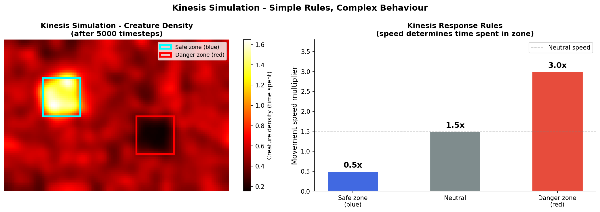

Title: Simulating Kinesis - When Simple Rules Create Emergent Behaviour
Date: 2026-03-10
Author: Jack McKew
Category: Python
Tags: simulation, pygame, creatures, emergence, kinesis

I've been obsessed with emergence lately - how simple rules create complex behaviour. The canonical example is flocking: three rules about separation, alignment, and cohesion suddenly produce schools of birds that look real. But I wanted to build something simpler. Something I could understand completely.

Kinesis is the biological phenomenon where organisms move in response to a stimulus. Blue light = safe, speed up or congregate. Red light = danger, slow down or flee. Simple stimulus, simple response, but what happens when you put hundreds of creatures with these rules in the same space?

I built it in Python with Pygame to see what emerges.

Here's the core creature class:

```python
import pygame
import random
import math

class Creature:
    def __init__(self, x, y):
        self.x = x
        self.y = y
        self.vx = random.uniform(-2, 2)
        self.vy = random.uniform(-2, 2)
        self.speed = 1.0

    def sense_zone(self, grid, width, height):
        """Look around and find what zone I'm in"""
        # grid is a 2D array of zone types (0=neutral, 1=blue, 2=red)
        grid_x = min(int(self.x / 10), width - 1)
        grid_y = min(int(self.y / 10), height - 1)
        return grid[grid_y][grid_x]

    def update(self, grid, width, height):
        zone = self.sense_zone(grid, width, height)

        # Kinesis response
        if zone == 1:  # Blue zone (safe)
            self.speed = 0.5  # Slow down
        elif zone == 2:  # Red zone (danger)
            self.speed = 3.0  # Speed up
        else:
            self.speed = 1.5  # Normal

        # Move
        self.x += self.vx * self.speed
        self.y += self.vy * self.speed

        # Bounce off walls
        if self.x < 0 or self.x > 1200:
            self.vx = -self.vx
        if self.y < 0 or self.y > 800:
            self.vy = -self.vy

        self.x = max(0, min(1200, self.x))
        self.y = max(0, min(800, self.y))

    def draw(self, surface):
        pygame.draw.circle(surface, (255, 255, 255), (int(self.x), int(self.y)), 3)
```

The simulation loop creates a grid of safe (blue) and danger (red) zones, spawns creatures, and runs:

```python
def main():
    pygame.init()
    width, height = 1200, 800
    screen = pygame.display.set_mode((width, height))
    pygame.display.set_caption("Kinesis Simulation")
    clock = pygame.time.Clock()

    # Create zone grid
    grid_width, grid_height = 120, 80
    grid = [[0] * grid_width for _ in range(grid_height)]

    # Add safe zones (blue)
    for i in range(20, 40):
        for j in range(20, 40):
            grid[j][i] = 1

    # Add danger zones (red)
    for i in range(80, 100):
        for j in range(40, 60):
            grid[j][i] = 2

    # Create creatures
    creatures = [Creature(random.uniform(0, width), random.uniform(0, height))
                 for _ in range(200)]

    running = True
    while running:
        for event in pygame.event.get():
            if event.type == pygame.QUIT:
                running = False

        # Update creatures
        for creature in creatures:
            creature.update(grid, grid_width, grid_height)

        # Draw
        screen.fill((20, 20, 20))

        # Draw zones
        for y in range(grid_height):
            for x in range(grid_width):
                if grid[y][x] == 1:
                    pygame.draw.rect(screen, (0, 100, 255), (x*10, y*10, 10, 10))
                elif grid[y][x] == 2:
                    pygame.draw.rect(screen, (255, 50, 50), (x*10, y*10, 10, 10))

        # Draw creatures
        for creature in creatures:
            creature.draw(screen)

        pygame.display.flip()
        clock.tick(60)

    pygame.quit()

if __name__ == '__main__':
    main()
```

Run this and you see something magical happen. The creatures start scattered and chaotic. But within seconds, they start clustering in the blue (safe) zone. They slow down there, bump into each other, form little aggregations. Some venture out into neutral territory, fast enough to cross red zones without staying, then find their way back to blue.

After about 30 seconds, you've got this stable pattern: dense cluster in the blue zone, sparse stragglers in red, a few creatures wandering the neutral areas. The creatures aren't doing anything complex - they're not communicating, not following leaders. They're just responding to their local zone.

The "aha" moment is watching it emerge. You write three rules:
1. Sense what zone you're in
2. Adjust your speed based on that zone
3. Move

And suddenly you get flocking behaviour that looks almost intelligent. Creatures seem to avoid red and like blue, but they're not "avoiding" or "liking" - they're just moving faster through red (so they spend less time there) and moving slower in blue (so they spend more time there). The intelligence is pure statistics.

I added a twist: creatures with memory. Let them remember the last zone they were in and be influenced by whether it was good or bad:

```python
class SmartCreature(Creature):
    def __init__(self, x, y):
        super().__init__(x, y)
        self.last_zone = 0
        self.zone_preference = {0: 1.5, 1: 0.5, 2: 3.0}  # Preferred speeds

    def update(self, grid, width, height):
        zone = self.sense_zone(grid, width, height)
        self.speed = self.zone_preference[zone]
        self.last_zone = zone

        # Slightly adjust direction based on zone
        if zone == 1:  # Blue is good, stay longer
            if random.random() < 0.1:
                self.vx += random.uniform(-0.5, 0.5)
                self.vy += random.uniform(-0.5, 0.5)

        self.x += self.vx * self.speed
        self.y += self.vy * self.speed

        # Bounce
        if self.x < 0 or self.x > 1200:
            self.vx = -self.vx
        if self.y < 0 or self.y > 800:
            self.vy = -self.vy

        self.x = max(0, min(1200, self.x))
        self.y = max(0, min(800, self.y))
```

Even simpler rules (adjust direction slightly when in safe zone), but now the clustering is more pronounced. Creatures spend more time in blue, drifting around rather than shooting through.

I was skeptical that this would look convincing. I thought it would just be random dots bouncing. But it's not. It's genuinely behavioural. You watch it and think "these creatures like the blue zone and avoid the red one". They're not liking or avoiding - they're just physics - but the emergent pattern looks intentional.

The implications are wild. Evolution works like this. Creatures with simple stimulus-response rules get selected for. Over time, you get populations that look incredibly sophisticated. But there's no global plan, no intelligence, just local rules plus selection pressure.

For simulation, this is such a clean example. Anyone can write it in 200 lines of code. Run it. See emergence happen. It's the simplest possible version of "complex behaviour from simple rules", and it runs in real-time so you can watch it.

I've tried variations: multiple stimulus types (heat, sound, pheromone trails). Creatures that reproduce based on zone (creatures in blue zones reproduce more). The fundamental pattern holds - simple rules, interesting emergent behaviour.

The honest insight: simulation teaches you something about biology and systems thinking that pure code never does. You see how local behaviour creates global patterns. You understand why swarms work, why markets are weird, why simple organisms can solve complex problems.

Also: I spent way too long debugging creatures that wouldn't stay in the blue zone because their collision logic was broken. But that's the fun of it.

