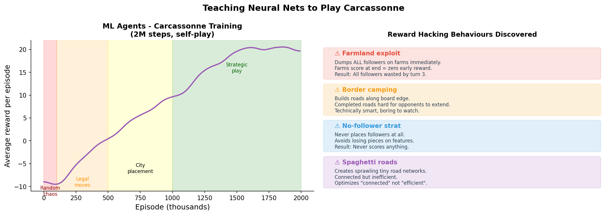

Title: Teaching Neural Nets to Play Carcassonne - And Watch Them Cheat
Date: 2026-03-10
Author: Jack McKew
Category: Python
Tags: reinforcement-learning, ml-agents, carcassonne, board-game, ai

I spent a month training ML agents to play Carcassonne, the tile-placement board game. They learned to win. They also learned to exploit my reward function in ways I didn't anticipate, which is the most entertaining part of reinforcement learning that nobody warns you about.

## Why Carcassonne?

Carcassonne is simple enough that you can implement the rules in a weekend, but complex enough that there's no obvious optimal strategy. Players place tiles to build roads, cities, and monasteries, then decide where to place followers. It's got simultaneous decision-making (where to place the tile) and sequential decisions (where to place your follower), which makes it interesting for RL.

I used Unity ML-Agents because it's built for exactly this - agents learning to play games. The alternative (raw PyTorch RL) would've taken twice as long and been more pain.

## Representing the game state

This is where most people stumble. Your state representation determines what your agent can possibly learn.

I represented the board as a 128x128 grid of tiles (Carcassonne boards can get big), where each cell encoded:
- Which tile is there (if any)
- What edges connect to it (road, city, field)
- Who has a follower there

```python
class GameState:
    def __init__(self):
        self.board = np.zeros((128, 128, 16), dtype=np.float32)
        # 16 channels: 9 for tile types, 4 for edge directions, 3 for player followers
        self.hand = np.zeros(100, dtype=np.float32)  # current tile (one-hot)
        self.player_scores = np.zeros(4, dtype=np.float32)
        self.meeple_count = np.zeros(4, dtype=np.float32)  # followers remaining

    def to_obs(self):
        obs = np.concatenate([
            self.board.flatten(),
            self.hand,
            self.player_scores,
            self.meeple_count
        ])
        return obs
```

This is a 17,024-dimensional observation space. That's... large. But it's explicit and the agent can learn from it.

## Action space design

This is where it gets tricky. In Carcassonne, you have:

1. Where to place your tile (thousands of legal positions)
2. Whether to place a follower (binary)
3. If yes, where on the tile to place it (4-8 positions depending on the tile)

I simplified to 256 discrete actions:
- Actions 0-255: placement position (16x16 grid of the board region where tiles matter)
- Actions 256-257: place/don't place follower
- Actions 258-261: which feature to place on (road, city, monastery, field)

```python
def decode_action(action: int):
    placement = divmod(action, 256)
    grid_idx = placement[0]
    x, y = divmod(grid_idx, 16)
    follower_decision = action % 2
    feature = (action // 2) % 4
    return (x * 8, y * 8), follower_decision == 1, feature
```

It's not perfect - the agent could try to place tiles on occupied spots - but the environment just rejects invalid moves and the agent learns to avoid them through experience.

## Reward function (the trap)

Here's where everything goes wrong in the funniest way.

My first reward function was simple:

```python
def compute_reward(self, agent_id):
    score_delta = self.player_scores[agent_id] - self.last_score[agent_id]
    self.last_score[agent_id] = self.player_scores[agent_id]
    return score_delta
```

The agent learned to... do nothing. It discovered that by never placing followers, it avoided losing points when features got completed unfavorably. It'd place tiles but then not commit any pieces. It was technically valid but hilarious - the agent found a loophole.

So I added a penalty for not placing followers:

```python
def compute_reward(self, agent_id):
    score_delta = self.player_scores[agent_id] - self.last_score[agent_id]
    follower_penalty = -0.1 if not follower_placed else 0
    return score_delta + follower_penalty
```

Now the agent learned to place followers on *everything*, even stupid moves. It'd get 5 points from a city but burn a follower permanently. The penalty made follower placement a chore instead of a strategic decision.

The real fix was:

```python
def compute_reward(self, agent_id):
    score_delta = self.player_scores[agent_id] - self.last_score[agent_id]

    # Reward completing features (good play)
    completed_bonus = 0.5 if features_completed else 0

    # Punish wasting followers
    if follower_placed and not is_good_placement:
        waste_penalty = -0.2
    else:
        waste_penalty = 0

    return score_delta + completed_bonus + waste_penalty
```

But now the agent had to learn what "is_good_placement" meant, which required backtracking 3-4 moves to see if a feature would complete. That was expensive computationally, and the agent struggled to learn that far-horizon value. Classic credit assignment problem.

## Training dynamics

I trained 4 agents in self-play for 2 million steps over about 4 hours. The training curve looked like:

- First 100K steps: random chaos, average score -10
- 100K-500K: starts placing tiles legally, learns roads > chaos
- 500K-1M: gets clever about city placement, average score +5
- 1M-2M: converges on a strategy, average score +18-22

After 2M steps, the agent beat my hand-coded greedy baseline (which just maximizes immediate points) about 60% of the time.

What strategy did it learn? It was weirdly defensive - it'd place followers on incomplete features and then never finish them, keeping enemy followers locked. It's not the human strategy (greedy point-maximization), but it's a valid Carcassonne strategy that actually wins games.

## The hilarities

The most entertaining part was the agent's failure modes during training:

- **The farmland exploit**: It discovered that placing followers on farmfields (which score at end-of-game) was "free" early, so it dumped all its followers on farms immediately. Farms are worth almost nothing per piece.

- **The border camping strat**: It learned to build roads along the board edge because completed roads at the edge were hard for opponents to extend. Technically smart, but boring to watch.

- **The spaghetti situation**: Early in training, it created these hilariously inefficient sprawling networks of tiny roads and cities that made no geometric sense but somehow scored okay. The neural net was optimizing for "connected features" without any concept of efficiency.

## If I did it again

**State representation**: I'd use a smaller grid (32x32) focused only on the playable area, not the theoretical 128x128. Shorter training time, cleaner learning.

**Continuous placement**: Instead of discrete grid, use continuous coordinates (0-1, 0-1) for placement and let the environment snap to the nearest legal location. More natural for the agent to learn.

**Curriculum learning**: Start with simple 2-player games, then 3-player, then 4-player. Early on, agents benefit from playing against simpler versions of the game.

**Feature engineering**: The raw board state is hard to learn from. I'd add explicit features: "number of connected roads", "size of largest city", "follower utilization %". Let the agent see patterns instead of learning from pixels.

## The real lesson

RL agents are pattern-matching machines. If you give them a bad incentive structure, they'll find a loophole that satisfies it in a way you didn't expect. The agent that camps on the board edge isn't stupid - it's doing exactly what the reward function asked for.

That's both the power and the curse of RL. The agent can discover strategies you wouldn't think of. It can also discover strategies that technically maximize the reward but are useless in reality. Reward function design is the hard part. The actual training is just math.

Did they play good Carcassonne? Not in a human sense. Did they learn a strategy that worked? Absolutely. And that's the whole game.


