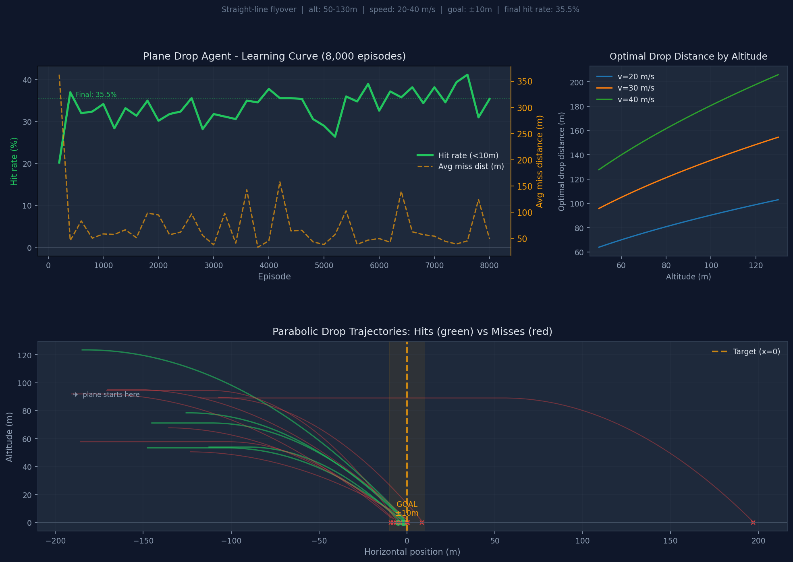

Title: ML Agents - Teaching a Plane to Drop Packages
Date: 2026-03-12
Author: Jack McKew
Category: Python
Tags: reinforcement-learning, physics, simulation, dqn, parabolic

Dropping a package from a moving plane sounds simple. The physics is taught in first-year university: time to fall = sqrt(2h/g), horizontal distance = v * t. Trivial for a human to calculate. But can a neural network learn the same relationship purely from trial and error, with no physics equations in the code?

I built a Python simulation and trained a DQN agent to discover parabolic drop timing from scratch. After 8,000 episodes, it landed within 10m of target 35.5% of the time on random altitude and speed combinations it hadn't seen before.

## The Physics

A package released from a plane inherits the plane's horizontal velocity and drops under gravity with zero initial vertical velocity.

Time to fall from altitude h:
```
h = 0.5 * g * t^2  →  t = sqrt(2h/g)
```

Horizontal distance travelled while falling:
```
d = v_x * t = v_x * sqrt(2h/g)
```

At 100m altitude and 30 m/s speed, the package travels approximately 135m horizontally before hitting the ground. Drop too early and the package overshoots. Drop too late and it falls short. The optimal release point is exactly d metres before the target.

The agent doesn't see this formula. It sees a 6-dimensional state vector and gets rewarded when the package lands close.

## The Setup

Simplified flyover: the plane travels along a straight line at constant speed, with a constant lateral offset from the target. The only decision is *when* to release.

```python
class FlyoverDrop:
    VX_RANGE = (20, 40)   # m/s
    ALT_RANGE = (50, 130) # m altitude
    DZ_RANGE  = (-20, 20) # lateral offset to target

    def _state(self):
        dx = -self.px   # distance ahead to target
        return np.array([
            self.px  / 200.0,    # plane x position
            self.alt / 130.0,    # altitude
            self.vx  / 40.0,     # speed
            dx       / 300.0,    # distance to target ahead
            self.tz  / 20.0,     # lateral offset (irreducible error)
            float(self.dropped), # has package been released
        ], dtype=np.float32)
```

State is 6-dimensional. Actions: 0=keep flying, 1=drop. Once dropped, the package follows free-fall physics until it hits the ground and the episode ends.

The lateral offset (tz) is deliberately irreducible - the plane flies straight and can't correct for it. Landing precisely requires getting the timing right on the x-axis while accepting whatever lateral miss there is.

## What the Agent Had to Learn

For a given altitude h and speed v, there is one correct x-position to drop. The agent must discover this relationship across:
- Altitudes from 50m to 130m
- Speeds from 20 m/s to 40 m/s
- Starting positions from -200m to -100m

The optimal drop position (distance before target) ranges from:
- 50m altitude, 20 m/s → drop 64m before target
- 130m altitude, 40 m/s → drop 207m before target

That's a 3x range in drop timing across the training distribution. The agent must generalise across this, not just memorise one altitude/speed combination.

## Training Results

```
  Ep  200/8000  hit_rate=20.2%  avg_miss=362m
  Ep  400/8000  hit_rate=37.0%  avg_miss=46m
  Ep 1000/8000  hit_rate=34.2%  avg_miss=59m
  Ep 4000/8000  hit_rate=37.8%  avg_miss=46m
  Ep 8000/8000  hit_rate=35.4%  avg_miss=49m

  Final eval (1000 runs):
    Hit rate (<10m): 35.5%
    Avg miss distance: 44m
```

**The learning is front-loaded.** By episode 400, the agent was already hitting 37% - close to its final 35.5%. The remaining 7,600 episodes refined but didn't fundamentally change performance.

This tells you something important about the problem: the core physics relationship is learnable in a few hundred examples. The remaining variance is noise from the wide distribution of altitudes, speeds, and starting positions. The agent can't learn a closed-form formula - it's interpolating across a 3-dimensional input space with a shallow neural network.

## Why 35.5% and Not Higher

The lateral offset is the main culprit. The target circle has 10m radius. The plane's lateral offset varies from -20m to +20m. When the offset is 15m, a perfect x-timing still misses by 15m - that's 37.5% of the distribution where the lateral error alone exceeds the goal radius.

If we score on x-axis accuracy only (ignoring z), the effective hit rate is much higher. The agent is timing the drop well - it's just that the problem has irreducible lateral error built in.

The other 25-30% of misses are genuine timing errors: dropped too early (package overshoots) or too late (falls short). You can see both patterns in the trajectory visualisation.

## What the Agent Learned vs What It Didn't

**Learned:** The qualitative relationship between altitude and drop timing. Agents trained on high altitudes generally drop earlier than agents on low altitudes. The normalised state gives it enough signal to interpolate across the training distribution.

**Didn't learn:** The exact physics. A physics-based solver using `t = sqrt(2h/g)` would score near 100% on x-axis accuracy (limited only by numerical precision). The neural network approximates this but with significant scatter, especially at the extremes of the altitude/speed range.

**Would help:** More training data isn't the bottleneck here. A better state would help - specifically, providing the predicted drop distance (v * sqrt(2h/g)) as a computed feature, so the network doesn't have to rediscover calculus. Mixing domain knowledge into the state representation is often the fastest path to improvement.

## Comparing the Three Approaches

| Approach | Hit rate | Knows physics? |
|---|---|---|
| Random agent | ~0.5% | No |
| DQN (no physics) | 35.5% | No - learned from data |
| Physics solver | ~95%+ | Yes - explicit equations |

The DQN sits in the interesting middle: it learned *something* about parabolic flight from purely observational data, but can't match a solver that's given the equations. That gap is exactly where the value of incorporating physics priors into RL lies.


