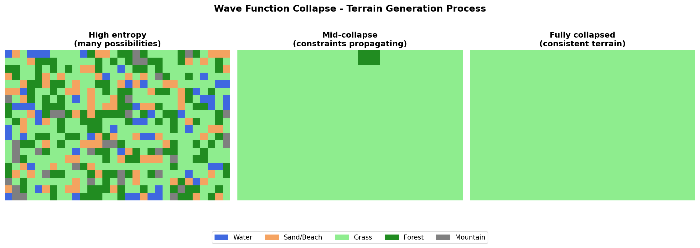

Title: Wave Function Collapse - Generative Art
Date: 2026-03-10
Author: Jack McKew
Category: Python
Tags: wave-function-collapse, generative-art, procedural, python, algorithms

I built a terrain generator that felt like magic. You give it a set of tile rules, press go, and it fills a grid with valid combinations. It's called Wave Function Collapse, and it's responsible for some of the weirdest, most organic-looking procedurally generated worlds.

## The core idea

Wave Function Collapse (WFC) comes from quantum mechanics - but don't let that scare you. The actual algorithm is simpler than it sounds.

You start with a grid of "superpositions" - each cell can be any tile from your set. Then you:
1. Pick a cell with the lowest entropy (fewest valid options)
2. Collapse it to a random choice from its valid options
3. Propagate constraints - update all neighbours to be compatible
4. Repeat until the grid is fully determined, or you hit a contradiction

It's constraint satisfaction through entropy minimisation. The quantum-ness is just the collapse step (superposition -> definite state), but really it's just random choice based on constraints.

## Implementation from scratch

Here's a minimal working version:

```python
import numpy as np
from collections import defaultdict
from dataclasses import dataclass

@dataclass
class Tile:
    id: int
    edges: tuple  # (top, right, bottom, left) edge signatures

# Define tiles. Each edge can connect to certain other edges.
tiles = [
    Tile(0, edges=('grass', 'grass', 'grass', 'grass')),      # flat
    Tile(1, edges=('grass', 'water', 'grass', 'grass')),      # water on right
    Tile(2, edges=('water', 'water', 'water', 'water')),      # full water
    Tile(3, edges=('grass', 'grass', 'water', 'grass')),      # water below
]

# Compatibility: for each direction, which (current, neighbor) pairs are valid?
# edges tuple: (top, right, bottom, left)
# Match rules: neighbor's opposite edge must match our edge in that direction
compatibility = defaultdict(set)
for a in tiles:
    for b in tiles:
        if a.edges[0] == b.edges[2]:  # a's top == b's bottom -> b can be above a
            compatibility['up'].add((a.id, b.id))
        if a.edges[1] == b.edges[3]:  # a's right == b's left -> b can be right of a
            compatibility['right'].add((a.id, b.id))
        if a.edges[2] == b.edges[0]:  # a's bottom == b's top -> b can be below a
            compatibility['down'].add((a.id, b.id))
        if a.edges[3] == b.edges[1]:  # a's left == b's right -> b can be left of a
            compatibility['left'].add((a.id, b.id))

class WFC:
    def __init__(self, width, height):
        self.width = width
        self.height = height
        # Each cell contains a set of possible tiles
        self.grid = [[set(t.id for t in tiles) for _ in range(width)] for _ in range(height)]
        self.collapsed = [[None for _ in range(width)] for _ in range(height)]

    def propagate(self, x, y):
        """Update constraints after collapsing a cell."""
        stack = [(x, y)]

        while stack:
            cx, cy = stack.pop()

            # For each direction, filter neighbours' possibilities
            directions = [
                ((cx, cy - 1), 'up', 0),    # top
                ((cx + 1, cy), 'right', 1), # right
                ((cx, cy + 1), 'down', 2),  # bottom
                ((cx - 1, cy), 'left', 3),  # left
            ]

            for (nx, ny), direction, edge_idx in directions:
                if 0 <= nx < self.width and 0 <= ny < self.height:
                    old_size = len(self.grid[ny][nx])

                    # Keep only tiles compatible with collapsed[cy][cx]
                    valid = set()
                    for tile_id in self.grid[ny][nx]:
                        for collapsed_id in self.collapsed[cy][cx]:
                            if (collapsed_id, tile_id) in compatibility[direction]:
                                valid.add(tile_id)

                    self.grid[ny][nx] = valid

                    # If we reduced possibilities, propagate further
                    if len(self.grid[ny][nx]) < old_size:
                        stack.append((nx, ny))

                    # Contradiction! This path leads nowhere.
                    if not self.grid[ny][nx]:
                        return False

        return True

    def collapse(self):
        """Run the WFC algorithm."""
        while True:
            # Find cell with lowest entropy (fewest possibilities)
            min_entropy = float('inf')
            best_cell = None

            for y in range(self.height):
                for x in range(self.width):
                    if self.collapsed[y][x] is None:
                        entropy = len(self.grid[y][x])
                        if entropy == 0:
                            return False  # Contradiction
                        if entropy < min_entropy:
                            min_entropy = entropy
                            best_cell = (x, y)

            if best_cell is None:
                return True  # Done!

            x, y = best_cell

            # Collapse to random choice
            tile_id = np.random.choice(list(self.grid[y][x]))
            self.collapsed[y][x] = [tile_id]
            self.grid[y][x] = {tile_id}

            # Propagate constraints
            if not self.propagate(x, y):
                return False  # Contradiction, backtrack or restart

# Run it
wfc = WFC(20, 20)
success = wfc.collapse()

if success:
    result = [[wfc.collapsed[y][x][0] for x in range(wfc.width)] for y in range(wfc.height)]
    print(np.array(result))
else:
    print("Failed - contradiction!")
```

That's the algorithm. It's remarkably simple once you strip away the quantum terminology.

## Why it's brilliant (and where it breaks)

The beauty of WFC is that it generates locally consistent output. Every tile respects its neighbours' constraints. You get patterns that look organic because the algorithm enforces compatibility, not because you programmed specific patterns.

But it has a fatal flaw: **backtracking**. If the algorithm paints itself into a corner (a state with contradictory constraints), it has to restart. On larger grids (50x50+), this happens often.

My first attempt crashed trying to generate a 50x50 map. I'd collapse cells, propagate constraints, and suddenly hit a cell with zero valid options. Restart. Repeat. After 30 failed attempts, I rage-quit.

Some solutions:
1. **Backtracking**: Instead of restarting, undo the last N collapses and try different choices. This works but is complex and slow.
2. **Smaller maps**: 20x20 works great. 30x30 is iffy. 50x50 requires careful tile design.
3. **Bias the entropy**: Don't pick randomly from all valid tiles - weight by likelihood. This reduces dead ends.
4. **Pre-compute valid sequences**: This is what the actual WFC algorithm (Karth & Lim's version) does - it learns which tile patterns work from a sample image.

## Using overlapping mode (the real deal)

The version above uses "simple tiling" mode. The actual WFC algorithm uses overlapping patterns learned from a sample image. The best Python implementation is `wfc-python` (or `wfc` on PyPI):

```bash
pip install wfc
```

```python
from PIL import Image
from wfc import WFC

# Learn from a sample image - WFC extracts NxN tile patterns automatically
sample_image = Image.open('sample_terrain.png')

# output_size in (width, height), limit=0 means retry until success
wfc_model = WFC(sample_image, output_size=(100, 100), n=3)
result = wfc_model.run()
result.save('generated.png')
```

The library handles pattern extraction, constraint generation, and backtracking. You just feed it an image and it learns what valid patterns look like.

This is how Townscaper works. You build a small town, and the algorithm learns constraints from it, then generates similar towns infinitely. It's genuinely clever.

## The weird failures are interesting

One of the best parts? When it fails, the failures tell you something. A contradiction usually means your tile rules are impossible to satisfy. You might have tiles that have incompatible edge signatures, or you might have a bottleneck - like only one tile type can bridge two regions, and the algorithm accidentally locked it off.

Debugging these failures teaches you about constraint systems. I once had a tile that only connected on its east edge, meaning it created a dead-end corridor. The algorithm would collapse cells leading to it, then realise: "Oh, this corner of the map is unreachable now." Dead end, restart.

Fixing it meant reconsidering the tile design. Not "write better code," but "think about topology." That's the kind of insight that makes procedural generation fun.

## Real-world use

WFC powers level generation in Knot, Bad North, and dozens of indie games. It's used for architecture, music, and art installations. The algorithm works wherever you have local constraints and want global coherence.

I've used it to generate weird procedural cave systems and biome maps. The results look genuinely natural because the algorithm respects physical constraints - water flows downhill, cliffs don't appear randomly, forests cluster together. You don't hard-code these rules; they emerge from your tile definitions.

The main limit is still backtracking. For guaranteed generation without restarts, you need careful tile design or to accept occasional failures. Most implementations just restart - it's the pragmatic move.

If you're into generative art, WFC is worth understanding. It's elegant, it's not as mathy as it sounds, and watching it generate a map is hypnotic.


